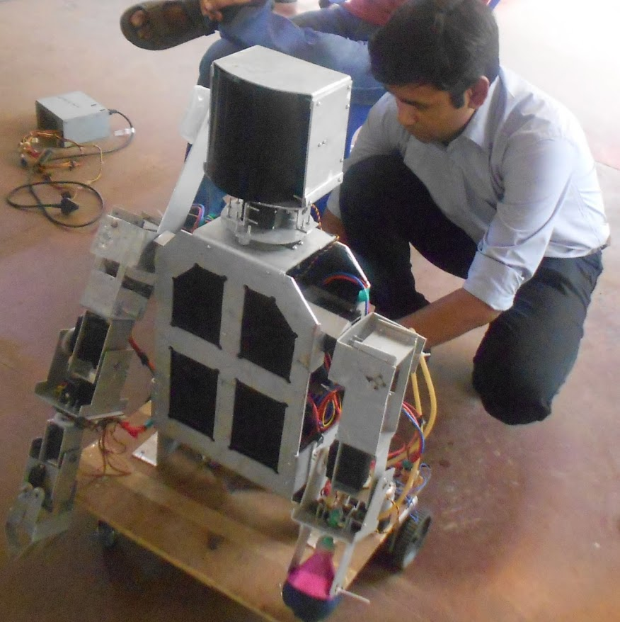

Vinay Yadav is Analytic Specialist in the
[Department of Biostatistics &amp; Medical Informatics](http://www.biostat.wisc.edu)
at the University of Wisconsin&ndash;Madison;
research in statistical genetics; developer of
[R/qtl](http://www.rqtl.org) (for [R](http://www.r-project.org)).

Karl received a BS in [mathematics](http://www4.uwm.edu/letsci/math/)
in 1991, from the
University of Wisconsin&ndash;Milwaukee, and a
PhD in [statistics](http://www.stat.berkeley.edu) in 1997, from the
University of California, Berkeley; his PhD advisor was
[Terry Speed](http://www.wehi.edu.au/faculty_members/professor_terry_speed).
He was a postdoctoral fellow with [James Weber](https://www.preventiongenetics.com/about-us/senior-staff/) at the
[Marshfield Clinic Research Foundation](http://research.marshfieldclinic.org),
1997-1999. He
was a faculty member in the [Department of Biostatistics](http://www.jhsph.edu/departments/biostatistics/) at Johns
Hopkins University, 1999-2007. In 2007, he moved to the
[University of Wisconsin&ndash;Madison](http://www.wisc.edu),
where he is now Professor.

Karl is an applied statistician focusing on problems in genetics and
genomics &ndash; particularly the analysis of meiotic recombination and the
genetic dissection of complex traits in experimental organisms. The
latter is often called &ldquo;QTL mapping.&rdquo; A QTL is a
_quantitative trait locus_ &ndash; a genetic locus that influences a
quantitative trait. Recently he has been focusing on the development
of interactive data visualizations for high-dimensional genetic data;
see his [R/qtlcharts package](http://kbroman.org/qtlcharts) and
his [D3 examples](http://www.biostat.wisc.edu/~kbroman/D3).

[curriculum vitae ]({{ BASE_PATH }}/assets/broman.pdf)

[orcid](http://orcid.org): [0000-0002-4914-6671](http://orcid.org/0000-0002-4914-6671)

---

<h4>Contact</h4>

    

        

            Vinay Yadav 
            Opera Solutions 
            Floor 6, Express Trade Tower - 1 
            Plot No 15-16, Sector 16-A 
            Film City 
            Noida - 201301 
            India  

            

            Email: <code>vinay</code><b>I</b><code>yadav</code><b>don't</b><code>3016</code><code>@</code><b>want</b><code>gmail</code><b>spam!
            </b><b>So</b><code>.</code><b>please</b><code>com</code><b>leave
            </b><b>me</b><b>alone</b><b>!</b> 
            

        

        

            
        

    

